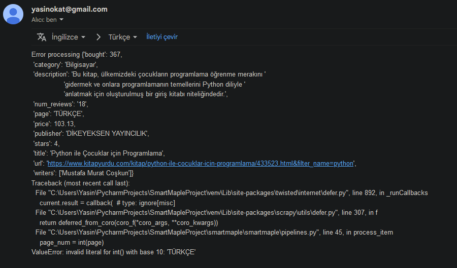
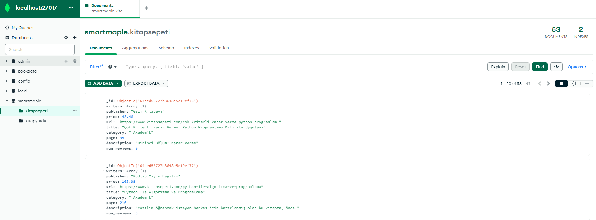
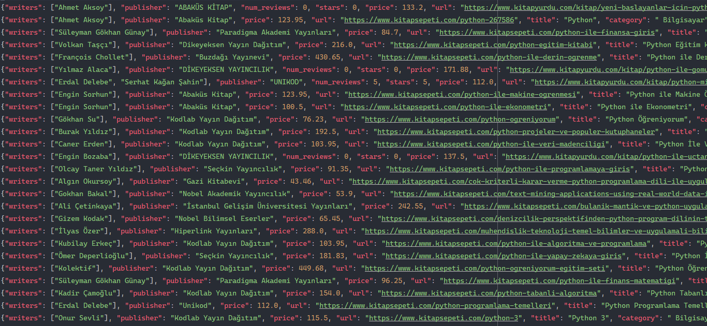

# Smart Maple Book Scraping Project

# Introduction

A Web Scraper project built using Scrapy library in Python. The scraper crawling on two websites (kitapsepeti.net, kitapyurdu.com) and scrapes details such as, authors, title, number of times bought, how many stars it received, price, publisher etc.  of books about Python. 
Then it saves all these data to MongoDB, the data scraped from kitapyurdu.com is saved to kitapyurdu collection, while the data scraped from the kitapsepeti is saved to the kitapsepeti collection, in the database smartmaple. 

# Requirements

- Python 3.x
- Scrapy
- pymongo
- schedule
- fake-useragent
- scrapy-rotating-proxies
- scrapy-splash

# Features

- Multiple web scraping: Scrapes two websites, kitapyurdu and kitapsepeti
- Sending email: Sends email when error occurs while scraping
- Saving to MongoDB: Saves data to MongoDB, to not allow multiple same data, it checks if the data is in the database, if it's in the database, it updates the entry
- Uses random user agent: Utilizes the fake-useragent library to generate random useragents, some pages block the requests sent from same user agent, this prevents that
- It scrapes: url, title, publisher, writers, price, number of times bought, number of reviews, stars, category, description, and pages
- Uses both css and xpath selectors
- Iterates over pages
- Rotating proxy list, some websites blocks the ip addresses to prevent data scraping, by using multiple proxies, it can bypass that, however, the option is disabled since the free proxies I have used is dying
- Utilises pipelines to clean data: extractin numbers, removing whitespaces, etc.

# Installation

1. Clone the repository
   
   ```bash
   git clone https://github.com/YasinOkat/SmartMapleTestProject.git
3. Navigate to the repo path

   ```bash
   cd SmartMapleProject
5. Install the requirements

   ```bash
   pip install -r requirements.txt 
  
# Usage
1. Navigate to to file:
   
   ```bash
   cd smartmaple
2. Start scraping data:
   
   ```bash
   scrapy crawl bookspider
4. To save the data to a json:
   
   ```bash
   scrapy crawl bookspider -O pythondata.json
5. This will fetch and save all the data to mongodb, don't forget to change the values for your database in the settings.py file:

   ```bash
   MONGO_URI = 'mongodb://localhost:27017/'
   MONGO_DATABASE = 'smartmaple'
6. If you want to schedule the scraping project to run every 1 hour, go to the file where scheduler.py is located run the command below:
    
   ```bash
   python scheduler.py
7. If you want to change the time interval, edit the code in scheduler.py:
    
   ```bash
   schedule.every(1).hours.do(run_spider)  # Runs the scraper every 1 hour
   ```
8. It also has a feature to send email if an error while scraping occures, change the values below in the settings.py file:

  ```bash
  EMAIL_FROM = 'mail@gmail.com'
  EMAIL_TO = 'mail@gmail.com'
  SMTP_SERVER = 'smtp.gmail.com'
  SMTP_PORT = 587
  SMTP_USERNAME = 'mail@gmail.com'
  SMTP_PASSWORD = 'pass'
   ```
   
# Screenshots

<p align="center">
  
</p>
<p align="center">
  
</p>
<p align="center">
  
</p>

